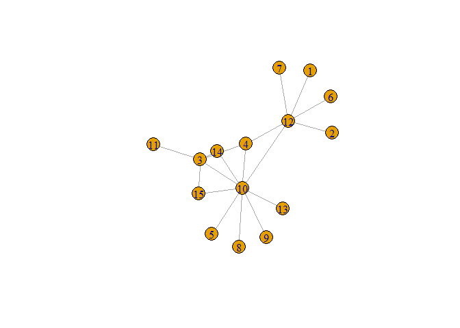

# Enunciado

Este trabalho consiste na análise de duas redes.

Numa destas redes representam-se as finais da Taça de Portugal desde a época de 2000-01
até à época de 2020-21, com excepção das épocas de 2003-04, 2007-08 e 2012-13. Cada nodo
representa uma equipa e cada ligação uma final. Nas tabelas seguintes indicam-se as
equipas e as finais.

+------------+--------------------------------+
| Nodos      | Equipa                         |
+:==========:+:==============================:+
| 1          | Académica                      |
+------------+--------------------------------+
| 2          | Belenenses                     |
+------------+--------------------------------+
| 3          | Benfica                        |
+------------+--------------------------------+
| 4          | Braga                          |
+------------+--------------------------------+
| 5          | Chaves                         |
+------------+--------------------------------+
| 6          | Desportivo das Aves            |
+------------+--------------------------------+
| 7          | Leixões                        |
+------------+--------------------------------+
| 8          | Marítimo                       |
+------------+--------------------------------+
| 9          | Paços de Ferreira              |
+------------+--------------------------------+
| 10         | Porto                          |
+------------+--------------------------------+
| 11         | Rio Ave                        |
+------------+--------------------------------+
| 12         | Sporting CP                    |
+------------+--------------------------------+
| 13         | União de Leiria                |
+------------+--------------------------------+
| 14         | Vitória de Guimarães           |
+------------+--------------------------------+
| 15         | Vitória de Setúbal             |
+------------+--------------------------------+

+-----------------------+----------------------+
| Equipa                | Equipa               |
+:=====================:+:====================:+
| Académica             | Sporting CP          |
+-----------------------+----------------------+
| Belenenses            | Sporting CP          |
+-----------------------+----------------------+
| Benfica               | Braga                |
+-----------------------+----------------------+
| Benfica               | Porto                |
+-----------------------+----------------------+
| Benfica               | Rio Ave              |
+-----------------------+----------------------+
| Benfica               | Vitória de Guimarães |
+-----------------------+----------------------+
| Benfica               | Vitória de Setúbal   |
+-----------------------+----------------------+
| Braga                 | Porto                |
+-----------------------+----------------------+
| Braga                 | Sporting CP          |
+-----------------------+----------------------+
| Chaves                | Porto                |
+-----------------------+----------------------+
| Desportivo das Aves   | Sporting CP          |
+-----------------------+----------------------+
| Leixões               | Sporting CP          |
+-----------------------+----------------------+
| Marítimo              | Porto                |
+-----------------------+----------------------+
| Paços de Ferreira     | Porto                |
+-----------------------+----------------------+
| Porto                 | Sporting CP          |
+-----------------------+----------------------+
| Porto                 | União de Leiria      |
+-----------------------+----------------------+
| Porto                 | Vitória de Guimarães |
+-----------------------+----------------------+
| Porto                 | Vitória de Setúbal   |
+-----------------------+----------------------+

A segunda rede é uma rede aleatória com 15 nodos e 18 ligações. Para obter esta rede, deve
utilizar-se a função `sample_gnm` com os parâmetros (n=15,m=18).

# Q1.

> Estude cada uma das redes quanto à densidade, ao grau dos nodos e grau médio. 
> Compare os resultados obtidos para as duas redes. 
> Interprete os valores obtidos para a primeira rede, no contexto da sua natureza.

## Grafo 1 - finais da Taça de Portugal


```r
### Graph 1
graph1 <- read_graph("Trab1.txt",
                 format = c("edgelist"), 
                 n = 15, 
                 directed = F)
plot(graph1) #, edge.curved=0.2, edge.arrow.size=0.5, edge.arrow.width=1)
```

<!-- -->

```r
edge_density(graph1, loops = F) 
```

```
## [1] 0.1714286
```

```r
# 0.08571429
sum(degree(graph1, mode = "total")) 
```

```
## [1] 36
```

```r
# grau total -> 36
mean(degree(graph1, mode = "total")) 
```

```
## [1] 2.4
```

```r
# grau médio -> 2.4
```
A densidade é baixa, uma vez que nem todos as equipas tiveram finais entre si e portanto não existem todas as arestas que poderiam existir para ser um grafo completo.

O grau é 36, uma vez que correspondem a 18 jogos entre um par de equipas, em 18 épocas.

O grau médio é elevado, mas não é um bom indicador do grau dos seus nodos, pois apesar de 9 das equipas apenas terem estado presentes uma vez e 3 delas apenas 2 ou 3 vezes, cada uma das 3 equipas mais presentes - Benfica, Sporting e Porto - estiveram presentes em todas as finais: Benfica = 5 (uma com o Porto), Porto = 9 (uma com Benfica e outra com Sporting), Sporting = 6 (1 com porto).

## Grafo 2 - rede aleatória


```r
### Graph 2
set.seed(42)
graph2 <- sample_gnm(15, 18)
plot(graph2)
```

<!-- -->

```r
edge_density(graph2, loops = F) 
```

```
## [1] 0.1714286
```

```r
# 0.1714286
sum(degree(graph2, mode = "total")) 
```

```
## [1] 36
```

```r
# grau total (grau incidente + grau divergente) -> 36
mean(degree(graph2, mode = "total")) 
```

```
## [1] 2.4
```

```r
# grau médio -> 2.4
```
A densidade é baixa, uma vez que nem todos os nodos estão ligados entre si diretamente - não é um grafo completo.

O grau médio acaba por espelhar melhor o tipo de grafo do que no caso anterior.


# Q2.

> Estude cada uma das redes quanto à associação de grau, aos comprimentos dos caminhos
mais curtos, à média dos comprimentos dos caminhos mais curtos, à conectividade, aos
coeficientes de clustering dos nodos e da rede. 
> Compare os resultados obtidos para as duas redes. 
> Interprete os valores obtidos para a primeira rede, no contexto da sua natureza.

## Rede 1 - finais da Taça

Começamos pelo Grafo 1, calculando a correlação de grau.


```r
### Graph 1
assortativity_degree(graph1, directed = F) 
```

```
## [1] -0.6627219
```

Verificamos que a correlação é negativa, pelo que concluímos que *a rede é não associativa*.
Este resultado não surpreende, pois os nodos de menor grau encontram-se ligados aos de maior grau, não existindo paridade de grau entre os nodos ligados entre si.

Olhando para as distancias:

```r
options(width = 90)
distances(graph1)
```

```
##       [,1] [,2] [,3] [,4] [,5] [,6] [,7] [,8] [,9] [,10] [,11] [,12] [,13] [,14] [,15]
##  [1,]    0    2    3    2    3    2    2    3    3     2     4     1     3     3     3
##  [2,]    2    0    3    2    3    2    2    3    3     2     4     1     3     3     3
##  [3,]    3    3    0    1    2    3    3    2    2     1     1     2     2     1     1
##  [4,]    2    2    1    0    2    2    2    2    2     1     2     1     2     2     2
##  [5,]    3    3    2    2    0    3    3    2    2     1     3     2     2     2     2
##  [6,]    2    2    3    2    3    0    2    3    3     2     4     1     3     3     3
##  [7,]    2    2    3    2    3    2    0    3    3     2     4     1     3     3     3
##  [8,]    3    3    2    2    2    3    3    0    2     1     3     2     2     2     2
##  [9,]    3    3    2    2    2    3    3    2    0     1     3     2     2     2     2
## [10,]    2    2    1    1    1    2    2    1    1     0     2     1     1     1     1
## [11,]    4    4    1    2    3    4    4    3    3     2     0     3     3     2     2
## [12,]    1    1    2    1    2    1    1    2    2     1     3     0     2     2     2
## [13,]    3    3    2    2    2    3    3    2    2     1     3     2     0     2     2
## [14,]    3    3    1    2    2    3    3    2    2     1     2     2     2     0     2
## [15,]    3    3    1    2    2    3    3    2    2     1     2     2     2     2     0
```

```r
# média dos comprimentos dos caminhos mais curtos 
mean_distance(graph1, directed = F) 
```

```
## [1] 2.219048
```

```r
# -> 1.485714
diameter(graph1, directed = F) # 4, para não direcionado
```

```
## [1] 4
```

A rede diz-se *conexa* porque existe um caminho entre qualquer par de nodos.

O diâmetro de 4 acaba por confirmar o facto de existirem equipas que participaram em mais do que uma final e que esta rede representa um "small world".


```r
transitivity(graph1)
```

```
## [1] 0.1818182
```

```r
# Global clustering coefficient -> 0.1818182
transitivity(graph1, type = "average")
```

```
## [1] 0.5240741
```

```r
# Average clustering coefficient -> 0.5240741
```

O Coeficiente de clustering é bem menor que 1, o que indica que existe fraca probabilidade que duas equipas que tenham jogado uma final, tenham ambas jogado uma final com uma outra equipa. Isso indica que não é fácil para algumas equipas chegarem várias vezes à final da Taça.

## Rede 2 - aleatória


```r
### Graph 2
assortativity_degree(graph2, directed = F) 
```

```
## [1] -0.25
```

```r
# 0.02857143
options(width = 90)
distances(graph2)
```

```
##       [,1] [,2] [,3] [,4] [,5] [,6] [,7] [,8] [,9] [,10] [,11] [,12] [,13] [,14] [,15]
##  [1,]    0    1    2    3    2    3    2    3    3     2     2     3     1   Inf     2
##  [2,]    1    0    2    2    1    3    1    2    2     1     1     2     1   Inf     1
##  [3,]    2    2    0    4    3    1    3    4    4     3     1     4     1   Inf     3
##  [4,]    3    2    4    0    1    5    1    4    1     3     3     2     3   Inf     3
##  [5,]    2    1    3    1    0    4    2    3    2     2     2     1     2   Inf     2
##  [6,]    3    3    1    5    4    0    4    5    5     4     2     5     2   Inf     4
##  [7,]    2    1    3    1    2    4    0    3    1     2     2     3     2   Inf     2
##  [8,]    3    2    4    4    3    5    3    0    4     1     3     4     3   Inf     1
##  [9,]    3    2    4    1    2    5    1    4    0     3     3     3     3   Inf     3
## [10,]    2    1    3    3    2    4    2    1    3     0     2     3     2   Inf     2
## [11,]    2    1    1    3    2    2    2    3    3     2     0     3     2   Inf     2
## [12,]    3    2    4    2    1    5    3    4    3     3     3     0     3   Inf     3
## [13,]    1    1    1    3    2    2    2    3    3     2     2     3     0   Inf     2
## [14,]  Inf  Inf  Inf  Inf  Inf  Inf  Inf  Inf  Inf   Inf   Inf   Inf   Inf     0   Inf
## [15,]    2    1    3    3    2    4    2    1    3     2     2     3     2   Inf     0
```

```r
mean_distance(graph2, directed = F) 
```

```
## [1] 2.483516
```

```r
# média dos comprimentos dos caminhos mais curtos -> 2.483516
diameter(graph2, directed = F) # 5
```

```
## [1] 5
```

Concluímos que, sendo a correlação negativa, *a rede é não associativa*. O que se pode observar por nodos de grau maior se ligarem a nodos de grau menor.

A rede é composta por duas subredes - uma desconexa composta do nodo 14, sem qualquer conexão, e outra componente gigante e conexa.

A componente gigante diz-se *conexa* uma vez que existe um caminho entre qualquer par de nodos.


```r
transitivity(graph2)
```

```
## [1] 0.1428571
```

```r
# Global clustering coefficient -> 0.1428571
transitivity(graph2, type = "average")
```

```
## [1] 0.2539683
```

```r
# Average clustering coefficient -> 0.2539683
```

O Coeficiente de clustering também é bem menor que 1, o que indica que não existem relações próximas entre todos os nodos.

# Q3.

> Determine para cada uma das redes as medidas de centralidade e o parâmetro de heterogeneidade. Interprete os valores obtidos. 
> O que pode concluir quanto à existência de hubs? Quais serão os hubs, no caso de existirem? Justifique. 
> Efetue a decomposição de core de cada uma das redes.

